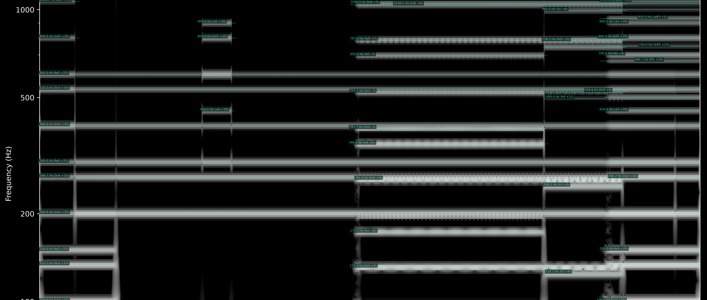

# SAPFA — Spectral Audio Partials Frequency Annotator

SAPFA reads an audio file (WAV, FLAC, AIFF…), finds its partials and labels each one with its
frequency, the nearest note and the deviation in cents. It writes an annotated spectrogram (PNG)
and a table of the partials (CSV).



## Installation

Tested with Python 3.12.

```bash
python -m venv .venv
.venv/bin/pip install -r requirements.txt
```

## Usage

```bash
.venv/bin/python sapfa.py input.wav
.venv/bin/python sapfa.py input.wav -p mid -o out --dpi 300
```

| Option | Default | Description |
|---|---|---|
| `-p`, `--precision` | `high` | Analysis precision: `low`, `mid`, `high`, `extra` |
| `-o`, `--outdir` | folder of the input | Output folder |
| `--dpi` | `500` | Resolution of the PNG |

The results are saved as `<name>_<precision>.png` and `<name>_<precision>.csv`.

### Precision

The precision level sets the length of the analysis window. A longer window separates partials
that lie closer together, at the cost of blurring onsets and offsets in time.

| Level | Window | Separates partials at least | Onset/offset blur up to |
|---|---|---|---|
| `low` | 0.17 s | ~16 Hz apart | ~0.09 s |
| `mid` | 0.34 s | ~8 Hz apart | ~0.17 s |
| `high` | 0.68 s | ~4 Hz apart | ~0.35 s |
| `extra` | 1.36 s | ~2 Hz apart | ~0.7 s |

`high` suits sustained sounds; `low` suits faster material. `extra` is intended for very stable
sounds: on acoustic instruments, the natural fluctuations of pitch can split a single partial
into several spurious ones.

## Output

**PNG.** A spectrogram on a logarithmic frequency axis from 15 Hz to 5 kHz. Each partial is
traced and labeled at its start, e.g. `440.0 Hz La4 +0c`. Partials shorter than 0.5 s appear
in the CSV but are not labeled.

**CSV.** One row per partial:

| Column | Description |
|---|---|
| `track_id` | Partial index, ordered by start time |
| `t_start`, `t_end` | Start and end time (s) |
| `freq_hz` | Median frequency over the partial (Hz) |
| `amp_db` | Peak amplitude (dBFS; a full-scale sine reads 0 dB) |
| `note` | Nearest equal-tempered note |
| `cents` | Deviation from that note, between -50 and +50 |

## How it works


The constant-Q spectrogram is only the background of the PNG; all measurements come from the
Fourier analysis.

## Tests

```bash
.venv/bin/python test_sapfa.py
```

Sines at known frequencies are analyzed at 44.1 and 96 kHz on every precision level. The test
checks that each frequency is measured within 1 cent, that each note name is correct and that
start and end times fall within half a window.

## Limitations

- Partials closer than the resolution of the chosen precision merge into one.
- Onsets and offsets are blurred by up to half a window.
- Stereo files are mixed down to mono.

## Roadmap

- Polyphonic fundamental estimation (harmonic summation) and the ratio of each partial to its
  fundamental.
- A flag for partials shared by several fundamentals.
- Temperaments from Scala (`.scl`) files.

## License

MIT, example sounds included. See [LICENSE](LICENSE).
